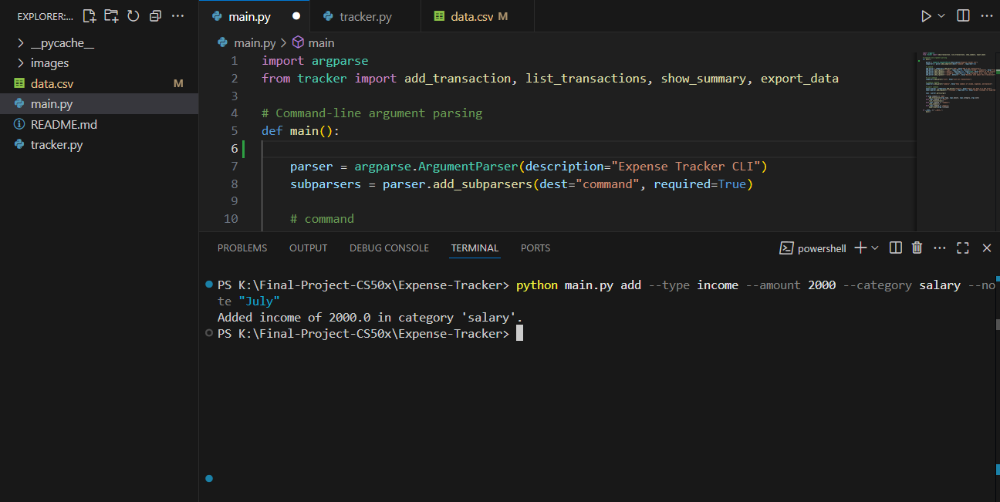
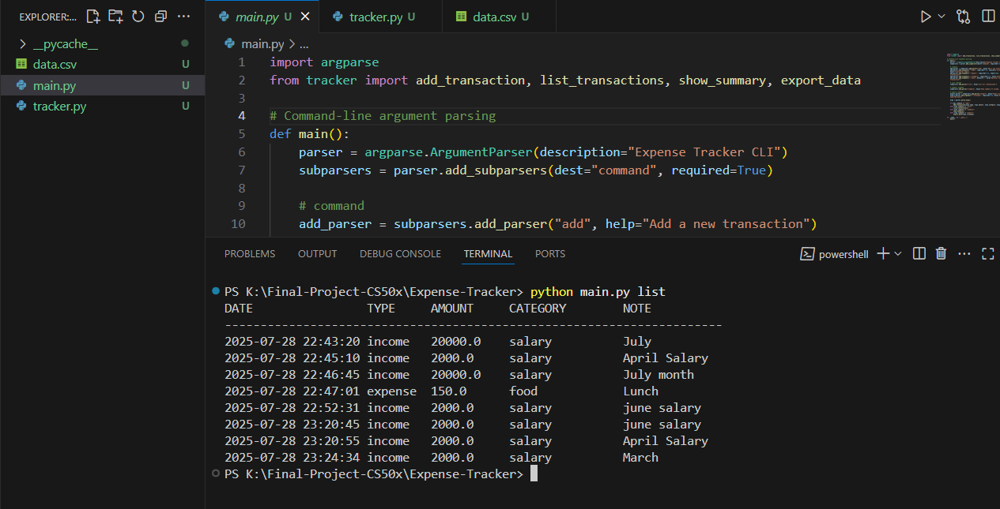

# Expense Tracker

#### Video Demo: [Watch on YouTube](https://youtu.be/QR86GZis4k8?si=X-wzGXxpkVNXScBN)

## Description
Expense Tracker is a simple yet powerful **command-line application written in Python** that allows users to record, manage, and analyze their personal expenses.  
This project was built as my **final project for CS50x** and brings together everything I learned during the course, including:

- Programming logic
- File handling
- Modular design
- Software structure

---

## 📁 Folder Structure

```
Expense-Tracker/
├── images/
│ ├── screenshot1.png
│ ├── screenshot2.png
├── main.py
├── tracker.py
├── data.csv
├── README.md
```

---

## 📸 Screenshots
Here are some screenshots showing the program in action:

Adding an expense


Listing expenses


---

## Overview
The goal of Expense Tracker is to provide a lightweight and easy-to-use tool for anyone who wants to manage their daily expenses without using spreadsheets or online services. With a few simple commands, you can add new transactions, list all past records, view a summary of expenses grouped by category, and export your data for backup.

The application uses a CSV file as its data store, ensuring that the records are both human-readable and portable. This allows users to access and back up their data easily.

---

## Features
Add an Expense

Quickly add an expense with details like amount, category, and a short note.
Example: python main.py add --amount 150 --category Food --note "Lunch"
List All Expenses

Display all stored transactions from data.csv in a neatly formatted table.
Summary

Show total spending and break it down by category.
Export

Save a copy of the data.csv file for backup.
These features make the program a practical tool for personal finance management.

---

## Design Choices
I deliberately designed this application as a command-line tool for these reasons:

Simplicity: It requires no additional installation or GUI framework.
Portability: It can be run on any machine that has Python installed.
Learning: This approach reinforced my understanding of argument parsing and file handling.
Why CSV instead of a database?
CSV is easy to read, simple to manage, and accessible via spreadsheets.
Keeps the project lightweight and beginner-friendly.
Avoids adding database setup complexity.
In future versions, I may migrate to SQLite to enable more advanced features such as filtering, editing, and multi-user data.

---

## How to Run
Ensure that Python 3 is installed on your computer.
Open your terminal or command prompt.
Navigate to the Expense-Tracker/ directory.
Use these commands:
```bash
python main.py add --type income --amount 20000 --category salary --note "July month"
python main.py list
python main.py summary
python main.py export
```
